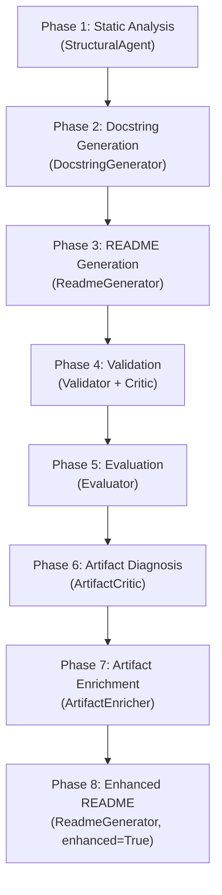

# Multi-Agent Hierarchical Documentation


An automated documentation generation system that analyzes source code repositories using tree-sitter AST parsing (7 languages) and an LLM (Qwen2.5-Coder) to produce Google-style docstrings, a comprehensive README, and enriched documentation artifacts — all through an 8-phase pipeline orchestrated by `pipeline/orchestrator.py`.

## Overview

This system takes a local repository path, performs static analysis (Phase 1) to extract an AST, dependency graph, and component clusters, then uses a lightweight LLM to generate docstrings (Phase 2) and a README (Phase 3). Subsequent phases validate (Phase 4), evaluate quality (Phase 5), diagnose artifact weaknesses (Phase 6), iteratively enrich artifacts (Phase 7), and regenerate an enhanced README with 11 sections (Phase 8).

**Business need:** Developers spend hours writing and maintaining documentation. This pipeline reduces that to minutes by grounding every generated sentence in real code analysis — function signatures, class names, dependency graphs, and business context extracted from docstrings.

**Key capabilities (traceable to source):**

- **Multi-language AST parsing** — `extract_ast_info()` in `analyzer/ast_extractor.py` uses tree-sitter to parse Python, Java, JavaScript, TypeScript, C, C++, and C# (extensions defined in `analyzer/language_router.py`)
- **Dependency graph construction** — `build_dependency_graph()` in `analyzer/dependency_builder.py` separates internal, external, and runtime dependencies for 7 languages
- **Component clustering** — `extract_components()` in `analyzer/component_extractor.py` groups modules by directory, hub-and-spoke topology, and naming patterns
- **LLM-powered docstring generation** — `DocstringGenerator` in `pipeline/docstring_generator.py` generates Google-style docstrings in topological order with content-based caching (`utils/cache.py`)
- **Artifact quality loop** — `ArtifactCritic` (`agents/artifact_critic.py`) detects CRITICAL/MAJOR/MINOR weaknesses; `ArtifactEnricher` (`agents/artifact_enricher.py`) iteratively resolves them (up to `max_iterations=3`)
- **4-bit quantization** — `LLMClient` in `utils/llm_client.py` loads the model with BitsAndBytes 4-bit quantization, reducing VRAM usage from ~7.6 GB to ~2 GB on a T4 GPU
- **Deterministic output** — `DeterminismEnforcer` in `utils/determinism.py` sorts all artifact keys and lists for reproducible results

## Architecture

The project contains two orchestrator entry points, a set of shared agents, language-agnostic analysers, a pipeline layer, and supporting utilities:

```
Multi-agent_Hierarchical_Documentation/
├── orchestrator.py                      # 5-phase coordinator (Phases 1–5)
├── pipeline/
│   ├── orchestrator.py                  # Full 8-phase coordinator (Phases 1–8)
│   ├── analyzer.py                      # Phase 1 wrapper
│   ├── docstring_generator.py           # Phase 2: DocstringGenerator class
│   ├── readme_generator.py              # Phase 3 / 8: ReadmeGenerator class (6- or 11-section)
│   ├── validator.py                     # Phase 4: Validator class
│   └── evaluator.py                     # Phase 5: Evaluator class
├── agents/
│   ├── base_agent.py                    # BaseAgent ABC: run(), save_artifact()
│   ├── structural_agent.py              # StructuralAgent (Phase 1 static analysis)
│   ├── writer.py                        # Writer: generate_docstring(), generate_readme()
│   ├── artifact_critic.py               # ArtifactCritic (Phase 6: weakness detection)
│   ├── artifact_enricher.py             # ArtifactEnricher (Phase 7: iterative enrichment)
│   └── prompts/                         # Fallback LLM prompt templates
├── analyzer/
│   ├── ast_extractor.py                 # extract_ast_info() — tree-sitter AST extraction
│   ├── dependency_builder.py            # build_dependency_graph() — 7-language support
│   ├── component_extractor.py           # extract_components() — hub-and-spoke clustering
│   ├── language_router.py               # LANGUAGE_EXTENSIONS dict (.py, .java, .js, .ts, .c, .cpp, .cs)
│   ├── tree_sitter_loader.py            # Tree-sitter grammar loading
│   ├── ast_utils.py                     # AST helper functions
│   └── file_metrics.py                  # File-level metric collection
├── schemas/
│   └── enriched_artifacts.py            # Pydantic models: Severity, Weakness, WeaknessReport,
│                                        #   EnrichedDocEntry, EnrichedASTEntry, EnrichedComponent
├── utils/
│   ├── llm_client.py                    # LLMClient: 4-bit quantization, generate()
│   ├── cache.py                         # get_cache_key(), load_from_cache(), save_to_cache()
│   ├── profiler.py                      # @profile_phase decorator, format_memory()
│   ├── artifact_utils.py                # resolve_name_from_ast(), detect_duplicate_docstrings()
│   ├── determinism.py                   # DeterminismEnforcer, DeterminismReport
│   ├── repo_scanner.py                  # clone_repo(), scan_repo_files()
│   ├── edge_case_handler.py             # Circular import / monolithic file detection
│   ├── performance_metrics.py           # PerformanceMonitor, OptimizationLogger
│   └── Doc_template/                    # Jinja2 MkDocs templates
├── phase1_analysis/                     # Legacy Phase 1 (backward-compatible)
├── phase2_docstrings/                   # Phase 2 agents and prompts
├── phase3_readme/                       # Phase 3 prompts (readme.md template)
├── phase4_validation/                   # Phase 4 agents (Critic)
├── phase5_evaluation/                   # Phase 5 prompts (evaluation.md template)
├── Docsys/                              # MkDocs generation: PipelineConfig, build_readme()
├── MP_Production_Salma/                 # Separate ML subsystem (propensity-score matching)
├── main.py                              # Interactive chat assistant entry point
├── demo.ipynb                           # Jupyter notebook walkthrough
└── requirements.txt                     # Runtime dependencies
```

### Pipeline Phases



**Phase 1 — Static Analysis** (`StructuralAgent` in `agents/structural_agent.py`)
- Calls `scan_repo_files()` from `utils/repo_scanner.py` to discover source files
- Runs `extract_ast_info()` (`analyzer/ast_extractor.py`) per file using tree-sitter
- Builds a dependency graph via `build_dependency_graph()` (`analyzer/dependency_builder.py`)
- Clusters modules into components via `extract_components()` (`analyzer/component_extractor.py`)
- Detects edge cases (circular imports, monolithic files) via `utils/edge_case_handler.py`
- Outputs: `ast.json`, `dependencies_normalized.json`, `components.json`, `edge_cases.json`

**Phase 2 — Docstring Generation** (`DocstringGenerator` in `pipeline/docstring_generator.py`)
- Processes modules in topological order (`_get_module_order()`) so each function sees its dependency context
- Generates Google-style docstrings using the `Writer.generate_docstring()` method (`agents/writer.py`)
- Content-based caching via `get_cache_key()` / `save_to_cache()` in `utils/cache.py` avoids redundant LLM calls
- Output: `doc_artifacts.json`

**Phase 3 — README Generation** (`ReadmeGenerator` in `pipeline/readme_generator.py`)
- Builds an analysis summary including actual function/class names and their docstring descriptions
- Loads `doc_artifacts.json` (Phase 2 output) for grounded context
- Sends the enriched summary to the LLM via `Writer.generate_readme()`
- Project name inferred by `_infer_project_name()` in `pipeline/orchestrator.py` (priority: `setup.py` → `pyproject.toml` → top-level `__init__.py` docstring → directory name)
- Output: `README.md` saved to the repository root

**Phase 4 — Validation** (`Validator` in `pipeline/validator.py`)
- Checks all 6 required README sections with heuristic rules
- `_detect_weak_patterns()` scans for placeholder text: "updated", "unknown", "Feature N", "TODO", "placeholder", "sample project"
- Output: in-memory results including `weak_pattern_issues` list

**Phase 5 — Evaluation** (`Evaluator` in `pipeline/evaluator.py`)
- Scores the README on four dimensions: clarity, completeness, consistency, usability (0–10 each)
- Output: `evaluation_report.json`

**Phase 6 — Artifact Diagnosis** (`ArtifactCritic` in `agents/artifact_critic.py`)
- Inspects `doc_artifacts.json`, `ast.json`, `dependencies_normalized.json`, `components.json`, `edge_cases.json`
- Categorises issues as CRITICAL (unknown/null names, corrupted JSON), MAJOR (missing `business_context`, `parameters`, `returns`, `raises`), or MINOR (optional fields absent)
- Output: `weakness_report.json` (structured `WeaknessReport` from `schemas/enriched_artifacts.py`)

**Phase 7 — Artifact Enrichment** (`ArtifactEnricher` in `agents/artifact_enricher.py`)
- Resolves names via `resolve_name_from_ast()` in `utils/artifact_utils.py`
- Detects duplicate docstrings via `detect_duplicate_docstrings()` in `utils/artifact_utils.py`
- Injects `business_context`, `signature`, and enriched descriptions
- Iterates until zero CRITICAL/MAJOR weaknesses or `max_iterations` (default 3) reached
- Output: enriched artifact JSON files (replaced in place)

**Phase 8 — Enhanced README** (`ReadmeGenerator` with `enhanced=True`)
- Generates 11 sections (Title, Executive Summary, Business Context, Architecture, Functions & Business Logic, Component Reference, Getting Started, Usage Guide, Developer Guide, Deployment, Troubleshooting)
- Uses a GENERATE → VALIDATE → ENHANCE → CONFIRM pipeline per section
- Each section's `_validate_section_specificity()` checks for the project name, minimum length, generic phrases, and code references
- `_enhance_section_with_llm()` sends the full codebase context to the LLM with instructions to reference only real symbols
- Saves individual `.docs` files to `artifacts/doc_sections/`
- Output: enhanced `README.md` + combined `.docs` file

## Installation

### Requirements

- Python 3.8+
- GPU recommended (T4 or better) — CPU-only mode is supported but slower
- CUDA for GPU acceleration (optional)

### Install Dependencies

From `requirements.txt`:

```bash
pip install -r requirements.txt
```

This installs:
- **pydantic** (≥2.7) — schema validation for `schemas/enriched_artifacts.py`
- **networkx** (≥3.2) — dependency graphs in `analyzer/dependency_builder.py`
- **tqdm** (≥4.66) — progress bars
- **transformers** (≥4.45.0), **accelerate** (≥0.33.0), **torch**, **sentencepiece** (≥0.2.0) — Hugging Face LLM inference in `utils/llm_client.py`
- **bitsandbytes** (≥0.41.0) — 4-bit quantization for `LLMClient`
- **tree-sitter** (≥0.20.0, <0.21.0), **tree-sitter-languages** (≥1.10.0) — AST parsing in `analyzer/ast_extractor.py`
- **psutil** (≥5.9.0) — memory tracking in `utils/performance_metrics.py`

## Usage

### Quick Start (Full 8-phase Pipeline)

```python
from pipeline.orchestrator import Orchestrator

orch = Orchestrator(
    repo_path="/path/to/your/project",
    artifacts_dir="./artifacts",
    model_id="Qwen/Qwen2.5-Coder-1.5B-Instruct",
    device="auto",
    quantize=True,
    use_structural_agent=True,
)

results = orch.run_all()  # Runs all 8 phases
orch.cleanup()            # Releases GPU memory via llm_client.cleanup()
```

### Quick Start (5-phase Pipeline)

The root `orchestrator.py` provides a simpler 5-phase pipeline (Phases 1–5):

```python
from orchestrator import Orchestrator

orch = Orchestrator(
    repo_path="/path/to/your/project",
    artifacts_dir="./artifacts",
    model_id="Qwen/Qwen2.5-Coder-1.5B-Instruct",
    device="auto",
    quantize=True,
    use_structural_agent=True,
)

results = orch.run_all()  # Runs Phases 1–5
orch.cleanup()
```

### Run Individual Phases

```python
# Phase 1: Static analysis (no LLM, fast)
phase1 = orch.run_phase1()
print(f"Modules: {phase1['stats']['modules']}")

# Phase 2: Docstring generation (requires Phase 1)
phase2 = orch.run_phase2()
print(f"Docstrings: {phase2['stats']['total']} (cached: {phase2['stats']['cached']})")

# Phase 3: README generation (requires Phase 1)
phase3 = orch.run_phase3()
print(f"README: {phase3['readme_path']}")

# Phase 4: Validation (requires Phase 3)
phase4 = orch.run_phase4()
print(f"Valid: {phase4['all_valid']}")
print(f"Weak patterns: {phase4['weak_pattern_issues']}")

# Phase 5: Evaluation (requires Phase 3)
phase5 = orch.run_phase5()
print(f"Score: {phase5['evaluation']['overall']}/10")
```

For Phases 6–8, use `pipeline.orchestrator.Orchestrator`:

```python
# Phase 6: Artifact diagnosis
phase6 = orch.run_phase6()
print(f"CRITICAL: {phase6['critical_count']}, MAJOR: {phase6['major_count']}")

# Phase 7: Artifact enrichment (iterates until clean)
phase7 = orch.run_phase7()
print(f"Enrichment done in {phase7['iterations']} iteration(s)")

# Phase 8: Enhanced README (post-enrichment)
phase8 = orch.run_phase8()
print(f"Enhanced README: {phase8['readme_path']}")
```

### Interactive Chat Assistant

`main.py` provides an interactive chat interface:

```bash
python main.py --model "Qwen/Qwen2.5-Coder-1.5B-Instruct" --device auto
```

CLI arguments:
- `--model` — Hugging Face model ID (default: `Qwen/Qwen2.5-Coder-1.5B-Instruct`)
- `--device` — `auto`, `cpu`, `cuda`, or `mps`
- `--no-quantize` — disable 4-bit quantization

### Using Jupyter Notebook

Open `demo.ipynb` in Jupyter or Google Colab for an interactive walkthrough of all phases.

### Project Name Inference

`_infer_project_name()` in `pipeline/orchestrator.py` resolves the project name in priority order:
1. `setup.py` — extracts the `name=` field via regex
2. `pyproject.toml` — reads the `[project]` or `[tool.poetry]` `name` field
3. Top-level `__init__.py` — first line of the module docstring
4. Directory name (fallback)

### Output Locations

| Phase | Output | Location |
|-------|--------|----------|
| 1 | AST data | `./artifacts/ast.json` |
| 1 | Dependencies | `./artifacts/dependencies_normalized.json` |
| 1 | Components | `./artifacts/components.json` |
| 1 | Edge cases | `./artifacts/edge_cases.json` |
| 2 | Docstrings | `./artifacts/doc_artifacts.json` |
| 2 | Cache | `./artifacts/cache/` |
| 3 / 8 | README | `<repo_path>/README.md` |
| 4 | Validation | In-memory (`weak_pattern_issues` in results) |
| 5 | Evaluation | `./artifacts/evaluation_report.json` |
| 6 | Weakness report | `./artifacts/weakness_report.json` |
| 8 | Section files | `./artifacts/doc_sections/*.docs` |

## Configuration

### Model Selection

```python
# Lightweight (recommended for T4 GPU, ~2 GB with 4-bit quantization)
model_id = "Qwen/Qwen2.5-Coder-1.5B-Instruct"

# More capable (requires more VRAM)
model_id = "Qwen/Qwen2.5-Coder-3B-Instruct"
```

### Memory Optimization

`LLMClient` in `utils/llm_client.py` supports BitsAndBytes 4-bit quantization:

```python
Orchestrator(
    quantize=True,   # 4-bit quantization via bitsandbytes (~4× memory reduction)
    device="auto",   # Auto-selects GPU if available
)
```

### Phase 1 Options

`StructuralAgent` in `agents/structural_agent.py` accepts:

```python
StructuralAgent(
    repo_path="/path/to/project",
    artifacts_dir="./artifacts",
    enable_performance_monitoring=True,   # Tracks execution time and memory via PerformanceMonitor
    enable_edge_case_detection=True,      # Detects circular imports and monolithic files
    enable_validation=True,               # Validates output JSON against schemas/
)
```

## Advanced Features

### Edge Case Detection (`utils/edge_case_handler.py`)
- Circular import detection in dependency graphs
- Monolithic file detection (files exceeding a line-count threshold)
- Generated-code detection (auto-generated files are skipped during analysis)

### Performance Monitoring (`utils/performance_metrics.py`)
- `PerformanceMonitor` and `OptimizationLogger` track per-phase timing and memory
- Caching statistics show cached vs. freshly generated docstrings

### Artifact Enrichment Loop (Phases 6–7)
- `ArtifactCritic.audit()` returns a `WeaknessReport` (defined in `schemas/enriched_artifacts.py`) with `Weakness` entries at CRITICAL / MAJOR / MINOR severity
- `ArtifactEnricher` calls `resolve_name_from_ast()` and `detect_duplicate_docstrings()` from `utils/artifact_utils.py`
- Iterates up to `max_iterations` (default 3) until `WeaknessReport.has_blocking_issues()` returns False

### Determinism (`utils/determinism.py`)
- `DeterminismEnforcer.sort_dict()` recursively sorts all dictionary keys
- `DeterminismEnforcer.sort_list()` sorts list elements for reproducible output
- Content-based cache keys (`get_cache_key()` in `utils/cache.py`) use SHA-256 hashes to prevent stale results

## Known Limitations

- **GPU memory:** The full pipeline requires ~7.6 GB VRAM without quantization. Use `quantize=True` and the 1.5B model on T4 GPUs.
- **Caching:** Phase 2 returns cached docstrings if file contents haven't changed. Delete `./artifacts/cache/` to force regeneration.
- **LLM accuracy:** Generated docstrings and README content reflect the LLM's interpretation. Always review before publishing.
- **Non-Python projects:** Phase 2 docstring generation is optimized for Python. Other languages receive basic documentation via tree-sitter AST extraction only.

## Enhancement Changelog

### v2.0 — Two-Agent Collaborative Enhancement

1. **Project Name Inference** — `_infer_project_name()` added to `pipeline/orchestrator.py` reads `setup.py`, `pyproject.toml`, or `__init__.py` before falling back to the directory name.
2. **Richer README Context** — `_build_analysis_summary()` in `pipeline/readme_generator.py` now includes actual function/class names with docstring descriptions, external dependency names, file structure, and component details from Phase 2 artifacts.
3. **No-hallucination README Prompt** — `phase3_readme/prompts/readme.md` requires every claim to be traceable to the Code Analysis and forbids generic filler.
4. **Business-Context Docstring Prompt** — `phase2_docstrings/prompts/docstring.md` instructs the LLM to capture *why* a symbol exists, not just *how* it works.
5. **Weak-Output Detection** — `_detect_weak_patterns()` in `pipeline/validator.py` scans for "updated", "unknown", "Feature N", "TODO", "placeholder", "sample project".
6. **Critic Placeholder Checks** — `agents/critic.py` validates every README section for placeholder patterns.
7. **Enhanced Jinja Templates** — `utils/Doc_template/mkdocs/` templates include badges, Mermaid flowcharts, and `business_role` fields.

## Documentation

- `ALL_OUTPUTS_GUIDE.md` — detailed guide to every output file
- `DOCUMENTATION_INDEX.md` — navigation index for all documentation
- `OUTPUT_LOCATION_SUMMARY.md` — quick reference for output paths

## Troubleshooting

### Out of Memory (GPU)

```python
Orchestrator(
    quantize=True,
    model_id="Qwen/Qwen2.5-Coder-1.5B-Instruct",
)
```

### Generated README shows "updated" / placeholder names

1. Ensure `setup.py` or `pyproject.toml` exists with a `name=` field in the target project so `_infer_project_name()` resolves correctly.
2. Delete `./artifacts/cache/` and rerun from Phase 2 to regenerate all docstrings.
3. Check Phase 4 output — `weak_pattern_issues` lists exactly which patterns were detected.

### Import Errors

```bash
find . -type f -name '*.pyc' -delete
find . -type d -name '__pycache__' -exec rm -rf {} +
```

### Model Loading Issues

```bash
pip install bitsandbytes
export PYTORCH_CUDA_ALLOC_CONF=expandable_segments:True
```

## Citation

```bibtex
@software{multi_agent_documentation,
  title={Multi-Agent Hierarchical Documentation},
  author={Salma Hisham and Contributors},
  year={2024},
  url={https://github.com/SalmaHisham/Multi-agent_Hierarchical_Documentation}
}
```

---

*Generated by Multi-Agent Hierarchical Documentation System v2.0*
