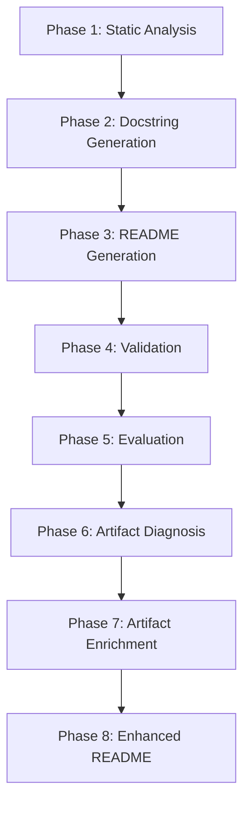

# Multi-Agent Hierarchical Documentation


A multi-agent documentation generation system that automatically analyzes codebases and generates comprehensive, high-quality documentation using LLMs.

## Overview

This system combines static code analysis with LLM-powered generation to create professional documentation for software projects. It features an **8-phase pipeline** that extracts code structure, generates Google-style docstrings, creates README files, validates output, evaluates quality, diagnoses artifact weaknesses, enriches artifacts with business context, and produces an enhanced final README.

**Business Need:** Developers spend significant time writing and maintaining documentation. This system automates the entire workflow — from parsing raw source code to delivering a production-ready README — reducing documentation time from hours to minutes.

**Key Features:**
- **Multi-language support**: Python, Java, JavaScript, TypeScript, C, C++, C#
- **Intelligent analysis**: AST extraction, dependency graphs, component clustering
- **LLM-powered generation**: Google-style docstrings and comprehensive READMEs with business context
- **Memory efficient**: 4-bit quantization, content-based caching, smart device management
- **Production-ready**: Validation, evaluation, artifact enrichment, and iterative improvement
- **Artifact quality loop**: Phases 6–8 diagnose, enrich, and regenerate documentation until no CRITICAL/MAJOR weaknesses remain

## Architecture

The system is organized into **8 distinct phases**:

```
multi-agent_hierarchical_documentation/
├── phase1_analysis/           # Static code analysis (tree-sitter)
│   ├── agents/               # StructuralAgent for orchestration
│   └── analyzer/             # AST, dependencies, components
├── phase2_docstrings/        # Docstring generation
│   ├── agents/               # Writer agent
│   └── prompts/              # Business-context-aware templates
├── phase3_readme/            # README generation
│   ├── prompts/              # Enriched README templates
│   └── readme_generator.py  # Context-rich README creation
├── phase4_validation/        # Quality validation
│   ├── agents/               # Critic agent
│   └── validator.py          # Heuristic checks + placeholder detection
├── phase5_evaluation/        # Quality evaluation
│   ├── prompts/              # Evaluation templates
│   └── evaluator.py          # Metrics and scoring
├── agents/                   # Shared agents
│   ├── artifact_critic.py   # Phase 6: Weakness detection
│   └── artifact_enricher.py # Phase 7: Iterative enrichment
├── orchestrator.py           # Main pipeline coordinator
├── utils/                    # Shared utilities
│   ├── artifact_utils.py    # Name resolution, dedup, Mermaid generation
│   └── Doc_template/        # Jinja2 MkDocs templates
└── schemas/                  # Pydantic models for artifact validation
```

### Pipeline Phases



**Phase 1: Static Analysis**
- Parses source code using tree-sitter (no LLM required)
- Extracts AST, dependency graphs, and component clusters
- Supports 7 programming languages
- Outputs: `ast.json`, `dependencies_normalized.json`, `components.json`, `edge_cases.json`

**Phase 2: Docstring Generation**
- Generates Google-style docstrings using an LLM (Qwen2.5-Coder)
- Business-context-aware prompts: captures *why* the code exists, not just *how*
- Dependency-aware topological ordering ensures consistent context
- Content-based caching avoids redundant LLM inference
- Output: `doc_artifacts.json`

**Phase 3: README Generation**
- Creates comprehensive README with 6 required sections
- Analysis summary includes actual function/class names from AST, module docstrings,
  external dependencies, and file structure — grounding the LLM output in real code
- Project name inferred from `setup.py`, `pyproject.toml`, or directory name
- Output: `README.md` in repository root

**Phase 4: Validation**
- Validates all 6 required README sections with heuristic rules
- **Weak-output detection**: scans for placeholder patterns ("updated", "unknown",
  "Feature 1") and fails validation when they appear
- Reports issues per section and overall quality score
- Output: In-memory validation results with `weak_pattern_issues` list

**Phase 5: Evaluation**
- Evaluates documentation quality across four dimensions: clarity, completeness,
  consistency, and usability
- Produces numerical scores and actionable feedback
- Output: `evaluation_report.json`

**Phase 6: Artifact Diagnosis** *(ArtifactCritic)*
- Inspects all artifact JSON files for CRITICAL, MAJOR, and MINOR weaknesses
- Detects: unknown/null names, duplicate docstrings, raw source code in docstrings,
  missing `business_context`, `pipeline_stage`, `parameters`, `returns`, `raises`
- Output: `weakness_report.json`

**Phase 7: Artifact Enrichment** *(ArtifactEnricher)*
- Resolves all issues found by Phase 6 through iterative enrichment
- Adds `business_context`, `pipeline_stage`, `signature`, enriched descriptions
- De-duplicates docstrings, resolves "unknown" names via AST cross-reference
- Iterates until zero CRITICAL/MAJOR weaknesses remain (up to `max_iterations`)
- Output: enriched `doc_artifacts.json`, `ast.json`, `components.json`, `edge_cases.json`

**Phase 8: Enhanced README**
- Regenerates README after artifact enrichment for higher-quality output
- Uses the same pipeline as Phase 3 but with enriched artifacts as context

## Installation

### Requirements
- Python 3.8+
- GPU recommended (T4 or better) — CPU-only mode supported but slower
- CUDA for GPU acceleration (optional)

### Install Dependencies

```bash
pip install transformers accelerate torch sentencepiece tree-sitter tree-sitter-languages networkx psutil pydantic

# For 4-bit quantization (recommended for GPU)
pip install bitsandbytes
```

### Clone Repository

```bash
git clone https://github.com/SalmaHisham/Multi-agent_Hierarchical_Documentation.git
cd Multi-agent_Hierarchical_Documentation
```

## Usage

### Quick Start

```python
from orchestrator import Orchestrator

# Initialize orchestrator
orch = Orchestrator(
    repo_path="/path/to/your/project",
    artifacts_dir="./artifacts",
    model_id="Qwen/Qwen2.5-Coder-1.5B-Instruct",
    device="auto",    # Use GPU if available
    quantize=True,    # 4-bit quantization
    use_structural_agent=True,
)

# Run all 8 phases
results = orch.run_all()

# Cleanup GPU memory
orch.cleanup()
```

### Run Individual Phases

```python
# Phase 1: Static analysis (no LLM, fast)
phase1 = orch.run_phase1()
print(f"Modules: {phase1['stats']['modules']}")

# Phase 2: Docstring generation
phase2 = orch.run_phase2()
print(f"Docstrings: {phase2['stats']['total']} (cached: {phase2['stats']['cached']})")

# Phase 3: README generation
phase3 = orch.run_phase3()
print(f"README: {phase3['readme_path']}")

# Phase 4: Validation (with weak-output detection)
phase4 = orch.run_phase4()
print(f"Valid: {phase4['all_valid']}")
print(f"Weak patterns: {phase4['weak_pattern_issues']}")

# Phase 5: Evaluation
phase5 = orch.run_phase5()
print(f"Score: {phase5['evaluation']['overall']}/10")

# Phase 6: Artifact diagnosis
phase6 = orch.run_phase6()
print(f"CRITICAL: {phase6['critical_count']}, MAJOR: {phase6['major_count']}")

# Phase 7: Artifact enrichment (iterates until clean)
phase7 = orch.run_phase7()
print(f"Enrichment done in {phase7['iterations']} iteration(s)")

# Phase 8: Enhanced README (post-enrichment)
phase8 = orch.run_phase8()
print(f"Enhanced README: {phase8['readme_path']}")
```

### Using Jupyter Notebook

Open `demo.ipynb` in Jupyter or Google Colab for an interactive walkthrough of all phases.

### Project Name Inference

The orchestrator automatically infers the project name in priority order:
1. `setup.py` — `name=` field
2. `pyproject.toml` — `[project]` or `[tool.poetry]` `name` field
3. Top-level `__init__.py` — first line of module docstring
4. Directory name (fallback)

### Output Locations

| Phase | Output | Location |
|-------|--------|----------|
| 1 | AST data | `./artifacts/ast.json` |
| 1 | Dependencies | `./artifacts/dependencies_normalized.json` |
| 1 | Components | `./artifacts/components.json` |
| 1 | Edge cases | `./artifacts/edge_cases.json` |
| 2 | Docstrings | `./artifacts/doc_artifacts.json` |
| 2 | Cache | `./artifacts/cache/` |
| 3/8 | README | `<repo_path>/README.md` |
| 4 | Validation | In-memory (`weak_pattern_issues` in results) |
| 5 | Evaluation | `./artifacts/evaluation_report.json` |
| 6 | Weakness report | `./artifacts/weakness_report.json` |

## Configuration Options

### Model Selection

```python
# Lightweight model for speed (recommended for T4 GPU, ~7.6 GB)
model_id="Qwen/Qwen2.5-Coder-1.5B-Instruct"

# More capable model (requires more memory)
model_id="Qwen/Qwen2.5-Coder-3B-Instruct"
```

### Memory Optimization

```python
Orchestrator(
    quantize=True,     # Use 4-bit quantization (cuts memory ~4x)
    device="auto",     # Automatic device selection
)
```

### Phase 1 Options

```python
# Enable optional features in StructuralAgent
enable_performance_monitoring=True  # Track execution time and memory
enable_edge_case_detection=True     # Detect circular imports, monolithic files
enable_validation=True              # Validate output JSON schemas
```

## Advanced Features

### Edge Case Detection
- Circular import detection
- Monolithic file detection (>1000 lines)
- Generated code detection (auto-generated files skipped)

### Performance Monitoring
- Per-phase timing and memory tracking
- Caching statistics (cached vs. generated docstrings)
- Optimization suggestions for large codebases

### Artifact Enrichment Loop
- `ArtifactCritic` scores every artifact entry with CRITICAL / MAJOR / MINOR severity
- `ArtifactEnricher` resolves all issues (name resolution, deduplication, field injection)
- Iterates up to `max_iterations` (default 3) until the codebase is clean

### Determinism
- Sorted outputs for reproducibility
- Content-based cache keys prevent stale results
- Deduplication across all artifact types

## Known Limitations

- **GPU memory**: Full pipeline requires ~7.6 GB VRAM with 4-bit quantization. Use the 1.5B model on T4 GPUs.
- **Caching**: If a project's files haven't changed, Phase 2 returns cached docstrings from a previous run. Delete `./artifacts/cache/` to force full regeneration.
- **LLM accuracy**: Generated docstrings and README content reflect the LLM's interpretation of the code. Always review before publishing.
- **Non-Python projects**: Phase 2 docstring generation is optimized for Python. Other languages receive basic documentation.

## Enhancement Changelog

### v2.0 — Two-Agent Collaborative Enhancement

**Developer Agent improvements:**

1. **Project Name Inference** (`pipeline/orchestrator.py`):
   - Added `_infer_project_name()` that reads `setup.py`, `pyproject.toml` (`[project]` and `[tool.poetry]` sections), or top-level `__init__.py` docstring before falling back to the directory name.
   - Eliminates "updated" or directory-name-as-project-name issues.

2. **Richer README Context** (`phase3_readme/readme_generator.py`):
   - `_build_analysis_summary()` now includes: actual function/class names with first-line docstrings, module-level docstrings as business context, full file structure, component hypotheses, and named external dependencies.
   - LLM output is grounded in real code rather than generic statistics.

3. **Improved README Prompt** (`phase3_readme/prompts/readme.md`):
   - Explicit instruction to use `{{project_name}}` and never produce "updated" or placeholders.
   - Features section must reference actual function/class names from code analysis.
   - Business-context requirement added to Overview section.

4. **Business-Context Docstring Prompt** (`phase2_docstrings/prompts/docstring.md`):
   - Prompts the LLM to capture *why* a symbol exists, not just *how* it works.
   - Domain inference guidance added (ARPU → telecom, WL/PL → pool-list matching, etc.).

5. **Weak-Output Detection** (`phase4_validation/validator.py`):
   - New `_detect_weak_patterns()` function scans full README for "updated", "unknown", "Feature N", "TODO", "placeholder", "sample project", "my project".
   - `run()` now returns `weak_pattern_issues` list and sets `all_valid=False` when patterns are found.

6. **Critic Placeholder Checks** (`agents/critic.py`):
   - `validate_readme_section()` now checks every section (not just architecture/features) for "updated", "unknown", and generic "Feature N" labels.

7. **Improved Jinja Templates** (`utils/Doc_template/mkdocs/`):
   - `index.md.j2`: added badges, module table, quick links.
   - `architecture_overview.md.j2`: added Mermaid pipeline flowchart, `business_role` and `architectural_layer` fields, file structure section.

## Documentation

- **Complete Guide**: `ALL_OUTPUTS_GUIDE.md`
- **Navigation Index**: `DOCUMENTATION_INDEX.md`
- **Output Summary**: `OUTPUT_LOCATION_SUMMARY.md`

## Troubleshooting

### Out of Memory (GPU)
```python
quantize=True
model_id="Qwen/Qwen2.5-Coder-1.5B-Instruct"
```

### Generated README still shows "updated" / placeholder names
1. Ensure `setup.py` or `pyproject.toml` exists with a `name=` field in the target project.
2. Delete `./artifacts/cache/` and rerun from Phase 2 to regenerate all docstrings.
3. Check Phase 4 output — `weak_pattern_issues` will list exactly which patterns were detected.

### Import Errors
```bash
find . -type f -name '*.pyc' -delete
find . -type d -name '__pycache__' -exec rm -rf {} +
```

### Model Loading Issues
```bash
pip install bitsandbytes
export PYTORCH_CUDA_ALLOC_CONF=expandable_segments:True
```

## Contributing

Contributions are welcome! Please feel free to submit issues or pull requests.

## License

See LICENSE file for details.

## Citation

If you use this system in your research, please cite:

```bibtex
@software{multi_agent_documentation,
  title={Multi-Agent Hierarchical Documentation},
  author={Salma Hisham and Contributors},
  year={2024},
  url={https://github.com/SalmaHisham/Multi-agent_Hierarchical_Documentation}
}
```

---

*Generated by Multi-Agent Hierarchical Documentation System v2.0*
